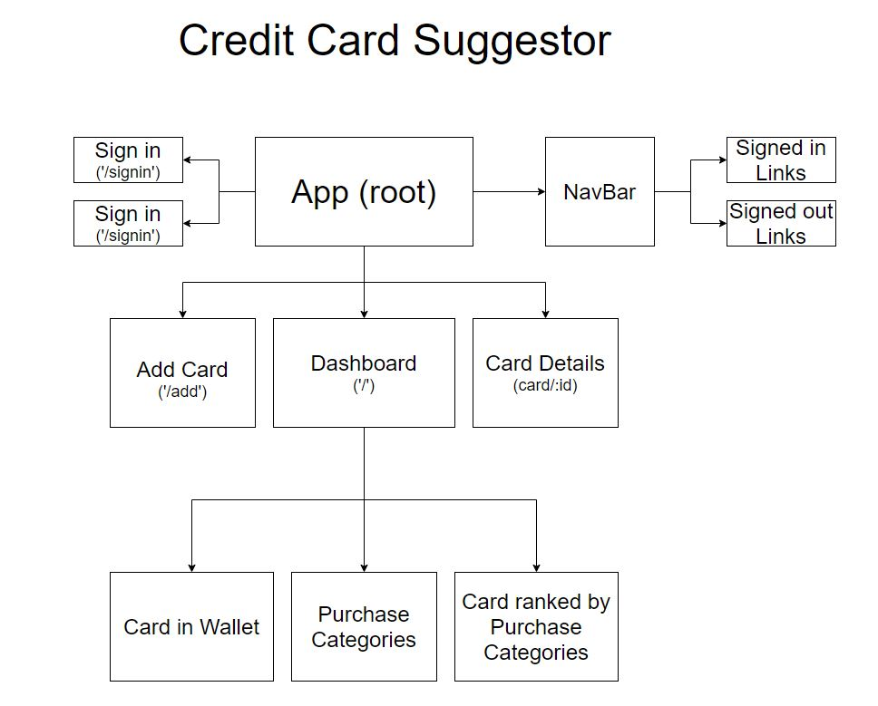

### Research & Planning Log
#### Friday, 09/17
* 8:15: review Friday Independent Projects Overview
* 8:45: review capstone proposal and brainstorm ideas
* 9:30: Start project in VS code
* 10:15: add description, MVP, Stretch Goals to README
* 10:45: add starter codes, get react running, set up components
* 11:15: Start coding!

#### Friday, 09/24
* 8:15: Good Morning!
* 8:30: created a side project to learn more about modern react with hooks by following the 32 parts youtube series from the net ninja.
* ...coding...
* 3:30: completed the side project
* 4:00: start creating a component tree for capstone

## Component Diagram

## Project Description
this app will help you figure out which of your 10+ credit cards to use when you need to make a purchase.

## Project MVP Features
* Allow user to create an account and select which credit cards they have from a list.
* Alllow user to add in a credit card if they are not listed in the app.
* Allow user to select a purchase category and return a list of credit cards in a ranked order of rewards"

## Project Stretch Goals
* make it on react native for mobile
* get it on the app store
* write a script to retrieve credit card reward updates"